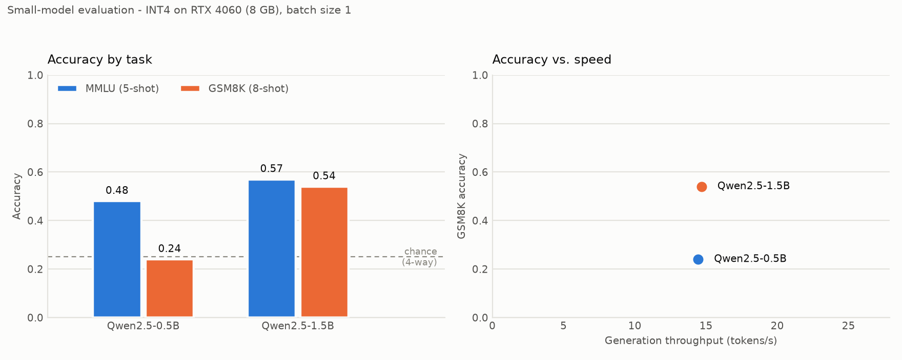

# benchmark

A small, reproducible evaluation harness comparing open-weight language models on
reasoning (MMLU) and math (GSM8K), measuring accuracy, generation throughput and
peak GPU memory on a single 8 GB consumer GPU.

<picture>
  <source media="(prefers-color-scheme: dark)" srcset="results/benchmark-dark.png">
  
</picture>

## Results

Hardware: RTX 4060 Laptop (8 GB), batch size 1, greedy decoding, 4-bit NF4.

Random chance on MMLU is 0.25, marked on the chart.

<!-- results:start -->
| Model        |   MMLU (5-shot) |   GSM8K (8-shot) |   Gen tok/s | Peak VRAM   |
|:-------------|----------------:|-----------------:|------------:|:------------|
| Qwen2.5-0.5B |            0.48 |             0.24 |        14.4 | 0.97 GB     |
| Qwen2.5-1.5B |            0.57 |             0.54 |        14.7 | 1.65 GB     |
| Phi-3-mini   |            0.62 |             0.77 |        15.4 | 3.35 GB     |

Going from Qwen2.5-0.5B to Phi-3-mini buys +0.14 MMLU and +0.53 GSM8K.

<!-- results:end -->

## Method

**MMLU (5-shot, 100 questions).** Scored by log-probability ranking over the
continuations `" A"`, `" B"`, `" C"`, `" D"` rather than by generating text and
string-matching. This is what `lm-evaluation-harness` does, and it matters: base
models asked to free-generate an MMLU answer often produce prose that no exact-match
rule will score, which reads as 0.00 accuracy regardless of whether the model knew
the answer. Where a tokenizer encodes `" A"` as multiple tokens (Phi-3's
SentencePiece does), the harness falls back to summing log-probabilities across the
full continuation.

Questions are drawn from four subjects — abstract algebra, high-school world
history, professional medicine, philosophy — 25 each. A single subject would have
been cheaper, but abstract algebra alone is where sub-2B models sit at chance, and
a chart where every bar reads 0.25 shows nothing.

**GSM8K (8-shot, 100 questions).** Greedy generation, up to 256 new tokens. The
predicted answer is the number following an explicit "The answer is N", falling
back to the last number in the completion, truncated at any fabricated next
`Question:`. Gold answers are the value after GSM8K's `####` marker. Both sides are
normalised so `12`, `12.0` and `12,000` compare correctly.

**Throughput.** Reported separately per task because the two measure different
things: MMLU is a single forward pass (prefill, thousands of tok/s), GSM8K is
autoregressive decoding (generation, tens of tok/s). The headline "Gen tok/s"
column is the GSM8K figure.

## Reading the throughput numbers honestly

All three models generate at 14–15 tok/s, and Phi-3-mini — 7.6× the parameters of
the 0.5B — is nominally the *fastest* of them. That is not a property of the
models: it is bitsandbytes NF4 dequantization overhead dominating at this size,
which makes the throughput column nearly uninformative as a model comparison.
**These are not native-precision speeds.** In bf16 the smaller models would be
several times faster and the three would separate clearly.

Everything runs 4-bit because Phi-3-mini's bf16 weights are 7.6 GB and do not fit
an 8 GB card alongside activations. Quantizing all three keeps accuracy, speed and
memory comparable across one consistent setup, at the cost of the two smaller
models carrying quantization they did not need. The accuracy-vs-speed panel is
plotted from zero for the same reason — on a zoomed axis a 0.3 tok/s gap would look
like a meaningful speed ranking.

## Reproducing

```bash
python -m venv .venv
.venv/Scripts/python.exe -m pip install torch --index-url https://download.pytorch.org/whl/cu128
.venv/Scripts/python.exe -m pip install transformers datasets accelerate bitsandbytes matplotlib pandas tqdm tabulate
.venv/Scripts/python.exe src/run.py
.venv/Scripts/python.exe src/report.py
```

The CUDA index URL is not optional. On Windows, plain `pip install torch` installs
a CPU-only build, which turns this suite from roughly 40 minutes into most of a day.

Useful flags:

| Flag | Effect |
|---|---|
| `--models Phi-3-mini` | Evaluate a subset; prior results for other models are preserved in the CSV |
| `--quant bf16` | Skip quantization (needs headroom for the model you pick) |
| `--stop-on-question` | Halt generation at the fabricated next `Question:` — roughly halves GSM8K runtime |
| `--gsm8k-examples`, `--mmlu-per-subject` | Change the sample sizes |

`src/run.py` writes `results/benchmark.csv` after every completed task, so an
interrupted run keeps whatever finished. Re-running one model merges into the
existing CSV rather than replacing it.

### `--stop-on-question`

These are base models doing few-shot completion, so they never emit EOS — they roll
straight on into inventing the next question and run to the token cap every time.
Stopping at that boundary yields the same extracted answer for about half the
compute. It is off by default only because it changes how many tokens the tok/s
average is taken over, and the numbers above were measured without it.

## Notes on this hardware

Loading Phi-3-mini needs ~7.6 GB of commit charge to memory-map its safetensors
shards. On a machine with a *fixed* pagefile this fails with
`OSError: The paging file is too small for this operation to complete (os error 1455)`
whenever another process is holding commit — a code-independent failure that looks
like a model bug. Check commit charge before debugging the loader:

```powershell
$os = Get-CimInstance Win32_OperatingSystem
"Commit free GB: {0:N1}" -f ($os.FreeVirtualMemory/1MB)
```

## Limitations

- 100 examples per task gives a standard error around ±5 points. Differences
  smaller than that are noise; the 0.24 → 0.77 GSM8K spread is not. The 0.57 → 0.62
  MMLU step between Qwen2.5-1.5B and Phi-3-mini is within noise and should not be
  read as a ranking.
- MMLU is 4 subjects of 57. This is a sanity-check harness, not a leaderboard run.
- Single run, no seed averaging. Decoding is greedy, so generation is deterministic,
  but sample choice is not varied.
- Throughput is measured at batch size 1, which is the latency case, not the
  throughput case a serving deployment would care about.
